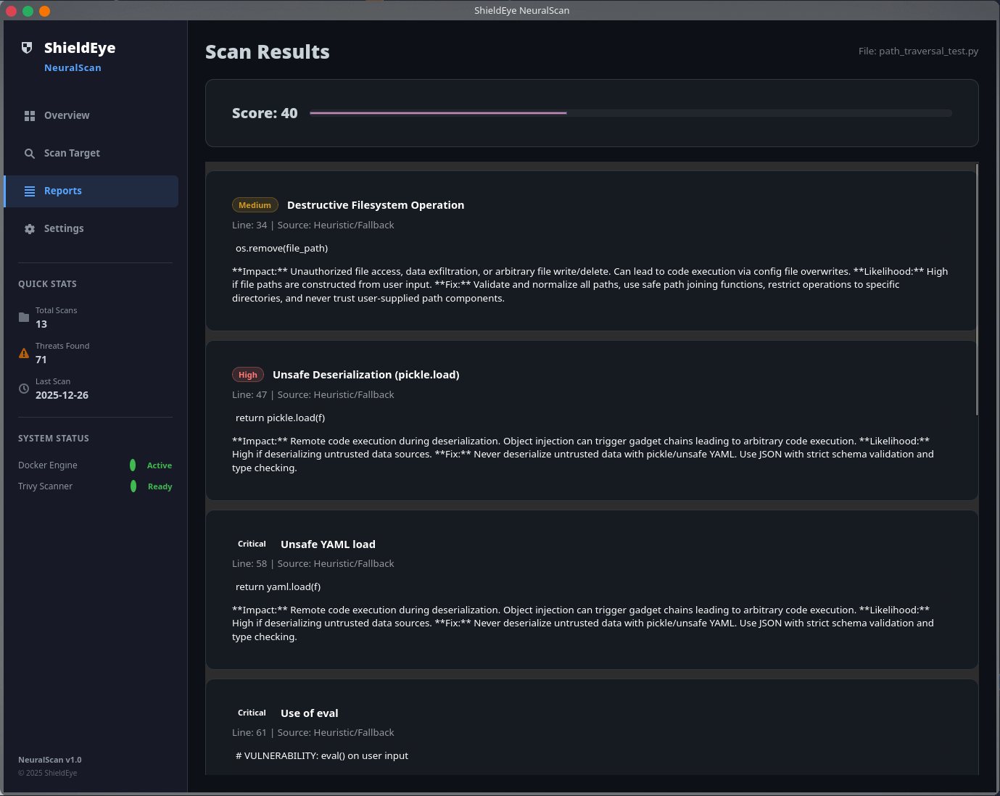
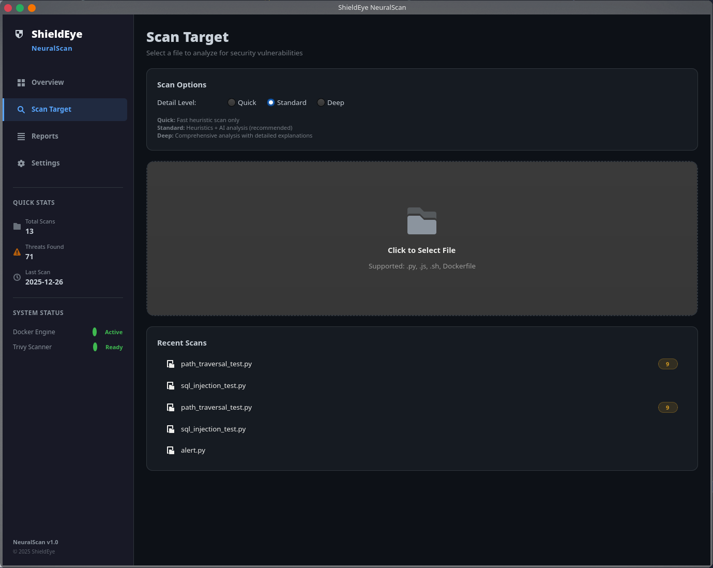
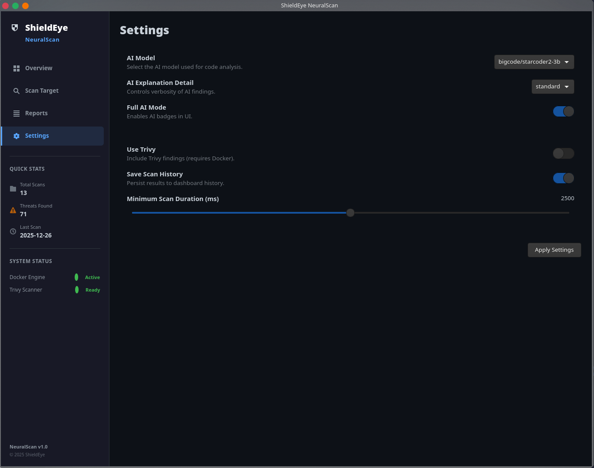

<div align="center">

# 🛡️ ShieldEye NeuralScan

**AI-Powered Source Code Security Analyzer**

*Static analysis • AI-driven insights • Local-first privacy*

[](https://opensource.org/licenses/MIT)
[](https://www.python.org/)
[](https://www.gtk.org/)
[](https://huggingface.co/docs/transformers)
[](https://www.docker.com/)

[Features](#-key-features) • [Quick Start](#-quick-start) • [Screenshots](#-screenshots) • [Documentation](#-documentation) • [Contributing](#-contributing)

---


</div>

---

## 🎯 What is ShieldEye NeuralScan?

ShieldEye NeuralScan is a **comprehensive security code analyzer** that combines traditional static analysis with cutting-edge AI technology. It provides:

- 🔍 **Advanced static analysis** with 50+ security patterns for common vulnerabilities
- 🤖 **AI-powered code review** using local transformer models (StarCoder2, Mixtral)
- 🐳 **Container security scanning** via optional Trivy integration
- 📊 **Real-time threat scoring** with risk categorization and compliance mapping
- 🖥️ **Modern GTK4 desktop interface** with intuitive navigation and dark theme
- 🔒 **100% local-first architecture** – all analysis happens on your machine

Whether you're a security researcher, developer, or DevSecOps engineer, ShieldEye NeuralScan delivers actionable insights into your code's security posture.

---

## ✨ Key Features

<table>
<tr>
<td width="50%">

### 🔍 Advanced Scanning
- **Static Analysis Engine**: 50+ regex-based patterns detecting SQL injection, command injection, XSS, path traversal, and more
- **AI Code Review**: Local transformer models provide contextual security explanations
- **Multi-Level Policies**: Quick, Standard, and Deep scan modes with configurable severity thresholds
- **Context-Aware Detection**: Adjusts risk scores based on surrounding code patterns and usage context

</td>
<td width="50%">

### 📦 Security Checks
- Command execution risks (`subprocess`, `os.system`, `eval`)
- SQL injection and NoSQL injection patterns
- Dynamic code execution (`exec`, `compile`)
- Unsafe deserialization (`pickle`, `yaml.unsafe_load`)
- Weak cryptography (MD5, SHA1, DES, ECB mode)
- Hardcoded secrets, API keys, and credentials
- Path traversal and directory manipulation
- Network exfiltration and data leakage patterns

</td>
</tr>
<tr>
<td width="50%">

### 🤖 AI Integration
- **Local Inference**: Hugging Face Transformers with no external API calls
- **Multiple Models**: StarCoder2-3B, StarCoder2-7B, Mixtral-8x7B support
- **Memory Optimization**: 8-bit quantization for efficient GPU/CPU usage
- **Graceful Fallback**: Heuristic explanations when AI is unavailable
- **Timeout Protection**: Resource limits prevent runaway inference

</td>
<td width="50%">

### 🔐 Compliance & Reporting
- **Standards Mapping**: CWE, OWASP Top 10, SANS Top 25
- **Compliance Tags**: PCI-DSS, NIST, GDPR, HIPAA annotations
- **Multi-Format Export**: JSON, Markdown, and HTML reports
- **Confidence Scoring**: Each finding includes confidence and severity metrics
- **Trivy Integration**: Optional container and dependency vulnerability scanning

</td>
</tr>
</table>

---

## 🖼️ Screenshots

<div align="center">

| Dashboard | Results |
|:---------:|:-------:|
|  |  |
| *Security posture overview and threat activity* | *Detailed findings with severity levels* |

| Scan Configuration | Settings |
|:------------------:|:--------:|
|  |  |
| *File selection and scan detail level options* | *AI model and scanner configuration* |

</div>

---

## 🏗️ Architecture

ShieldEye NeuralScan uses a **modular desktop architecture** for performance and maintainability:

```
┌──────────────────────────────────────────────────────────────┐
│                     GTK4 Desktop Interface                    │
│                    (Python 3 + PyGObject)                     │
│   ┌──────────┬──────────┬──────────┬──────────┬──────────┐   │
│   │Dashboard │   Scan   │ Results  │ Settings │  About   │   │
│   └──────────┴──────────┴──────────┴──────────┴──────────┘   │
└─────────────────────────────┬────────────────────────────────┘
                              │
                              ▼
┌──────────────────────────────────────────────────────────────┐
│                    Security Scanner Engine                    │
│              (Static Analysis + AI Integration)               │
│   ┌──────────────┬──────────────┬──────────────────────┐     │
│   │   Heuristic  │  AI Analyzer │  Trivy Integration   │     │
│   │   Patterns   │ (Transformers)│   (Docker/Optional)  │     │
│   └──────────────┴──────────────┴──────────────────────┘     │
└─────────────────────────────┬────────────────────────────────┘
                              │
                              ▼
                  ┌───────────────────────┐
                  │   Local File System   │
                  │  data/scan_history    │
                  │  data/config.json     │
                  └───────────────────────┘
```

### Tech Stack
| Component | Technology | Purpose |
|-----------|------------|----------|
| **GUI** | GTK 4.0, PyGObject | Native desktop interface |
| **AI Engine** | Hugging Face Transformers | Code analysis and explanations |
| **Static Analysis** | Python regex, AST parsing | Pattern-based vulnerability detection |
| **Container Scanning** | Trivy (optional) | Dependency and image vulnerability scanning |
| **Data Visualization** | Matplotlib | Threat activity charts |
| **Storage** | JSON files | Scan history and configuration |

---

## 🚀 Quick Start

### Prerequisites

| Requirement | Version | Notes |
|-------------|---------|-------|
| Python | 3.10+ | With pip and venv |
| GTK | 4.0+ | Desktop environment required |
| Git | Latest | For cloning repository |
| Docker | Latest | Optional, for Trivy integration |

### 1. Clone and Configure

```bash
git clone https://github.com/exiv703/ShieldEye-NeuralScan.git
cd ShieldEye-NeuralScan

# Create environment file (optional)
cp .env.example .env

# Edit .env to customize AI model, window size, etc.
```

### 2. Install Dependencies

```bash
# Make run script executable
chmod +x run.sh

# Install all dependencies (creates venv, installs packages)
./run.sh install
```

### 3. Launch the Application

```bash
# Interactive launcher with menu
./run.sh

# Or run directly
./run.sh run
```

### 4. (Optional) Enable AI Features

AI models download automatically on first scan. For GPU acceleration:

```bash
# Check CUDA availability
python -c "import torch; print(torch.cuda.is_available())"

# If True, AI will use GPU automatically
# If False, CPU inference will be used (slower but functional)
```

### 5. (Optional) Enable Trivy Container Scanning

```bash
# Install Docker
curl -fsSL https://get.docker.com -o get-docker.sh
sudo sh get-docker.sh

# Start Docker service
sudo systemctl start docker
sudo systemctl enable docker

# Enable Trivy in Settings or .env
USE_TRIVY=true
```

---

## 🎮 Using `run.sh`

The `run.sh` script provides an interactive menu for common tasks:

```bash
./run.sh
```

**Available options:**
- **Run** – Launch the application
- **Install** – Set up virtual environment and dependencies
- **Update** – Pull latest changes and update dependencies
- **Clean** – Remove virtual environment and cached files
- **Test** – Run test suite
- **Help** – Display usage information

---

## ⚙️ Configuration

### Environment Variables

Copy `.env.example` to `.env` and customize:

```bash
# Application Settings
APP_NAME=ShieldEye NeuralScan
APP_VERSION=1.0.0
APP_ENV=development

# AI Model Configuration
AI_MODEL=bigcode/starcoder2-3b
# Alternatives: bigcode/starcoder2-7b, mistralai/Mixtral-8x7B-Instruct-v0.1

# Scanner Settings
USE_TRIVY=false
SAVE_HISTORY=true
DEFAULT_DETAIL_LEVEL=standard

# UI Settings
WINDOW_WIDTH=1400
WINDOW_HEIGHT=900
THEME=dark
```

### Full Requirements

See [`requirements.txt`](requirements.txt) for Python dependencies and [`requirements-dev.txt`](requirements-dev.txt) for development tools.

---

## 📖 Documentation

- **User Guide**: Comprehensive usage instructions and best practices
- **API Reference**: Docstrings in `backend/scanner.py` for programmatic usage
- **Security Patterns**: Full list of detection rules in scanner source code
- **Test Files**: Example vulnerable code in `tests/` directory

## 🛠️ Development

### Local Setup (without Docker)

```bash
# Clone repository
git clone https://github.com/exiv703/ShieldEye-NeuralScan.git
cd ShieldEye-NeuralScan

# Create virtual environment
python3 -m venv venv
source venv/bin/activate

# Install dependencies
pip install -r requirements.txt
pip install -r requirements-dev.txt

# Run application
python gui/main.py
```

### Development Tools

```bash
# Format code
black backend/ gui/ utils/
isort backend/ gui/ utils/

# Lint code
pylint backend/scanner.py gui/ utils/

# Run tests
python -m pytest tests/
```

### Project Structure

```
ShieldEye-NeuralScan/
├── backend/
│   ├── __init__.py
│   └── scanner.py          # Core security scanner engine
├── gui/
│   ├── views/
│   │   ├── dashboard.py    # Overview and metrics
│   │   ├── scan.py         # File selection and scanning
│   │   ├── results.py      # Findings display
│   │   └── settings.py     # Configuration panel
│   ├── main.py             # Application entry point
│   ├── window.py           # Main window and navigation
│   └── style.css           # GTK CSS theming
├── utils/
│   └── file_handler.py     # Scan history persistence
├── tests/                  # Vulnerable test files
├── data/                   # Scan history and config
├── assets/                 # Screenshots and branding
├── .env.example            # Environment template
├── config.default.json     # Default configuration
├── requirements.txt        # Python dependencies
└── run.sh                  # Interactive launcher
```

**Design Principles:**
- Clean separation of GUI and business logic
- Modular view system with independent components
- Comprehensive error handling and logging
- Production-ready configuration management
- Privacy-first architecture with local-only processing

---

## 🤝 Contributing

Contributions are welcome! Here's how to get started:

1. **Fork** the repository
2. **Create** a feature branch: `git checkout -b feature/amazing-feature`
3. **Commit** your changes: `git commit -m 'Add amazing feature'`
4. **Push** to the branch: `git push origin feature/amazing-feature`
5. **Open** a Pull Request

**Guidelines:**
- Follow PEP 8 style guidelines
- Add tests for new security patterns
- Update documentation for new features
- Ensure all tests pass before submitting

---

## 📝 License

This project is licensed under the **MIT License** – see the [LICENSE](LICENSE) file for details.

---

## 🙏 Acknowledgments

- [Hugging Face](https://huggingface.co/) – Transformers library and model hosting
- [GTK Project](https://www.gtk.org/) – Cross-platform GUI toolkit
- [Aqua Security](https://www.aquasec.com/) – Trivy container scanner
- [BigCode](https://www.bigcode-project.org/) – StarCoder2 models
- [Mistral AI](https://mistral.ai/) – Mixtral models

---

<div align="center">

**⭐ If you find ShieldEye NeuralScan useful, please consider giving it a star! ⭐**

[](https://github.com/exiv703/ShieldEye-NeuralScan)

---

*Built with ❤️ for the security community*

**ShieldEye NeuralScan** – Securing code with AI, one scan at a time 🛡️

</div>
