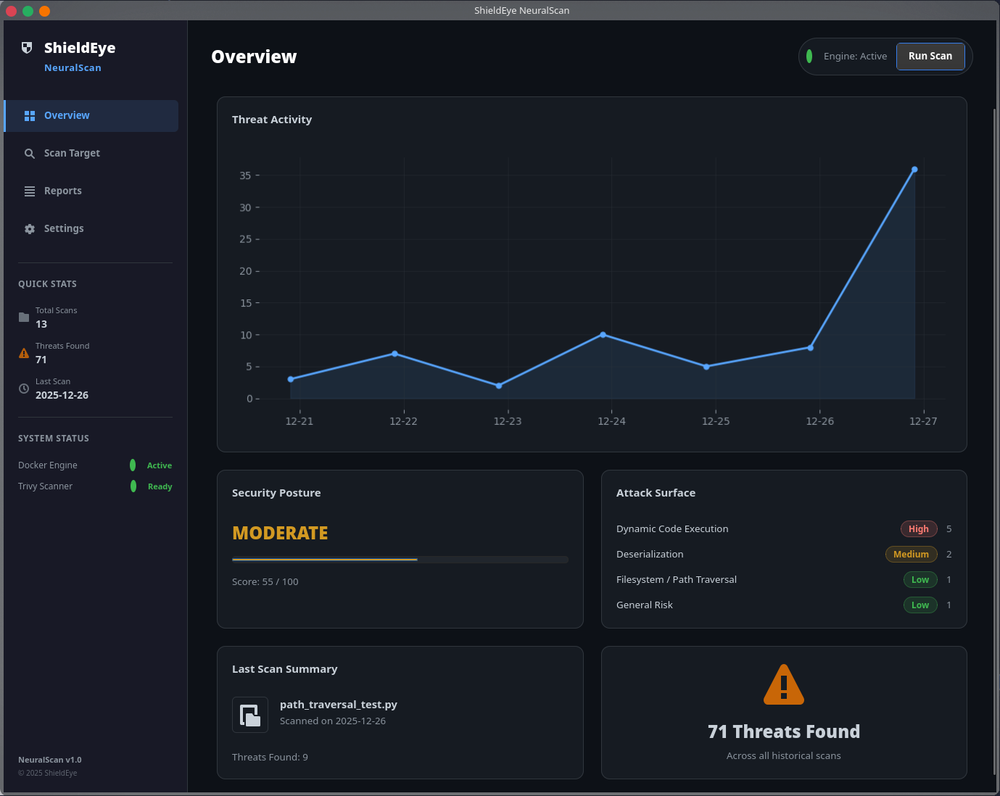
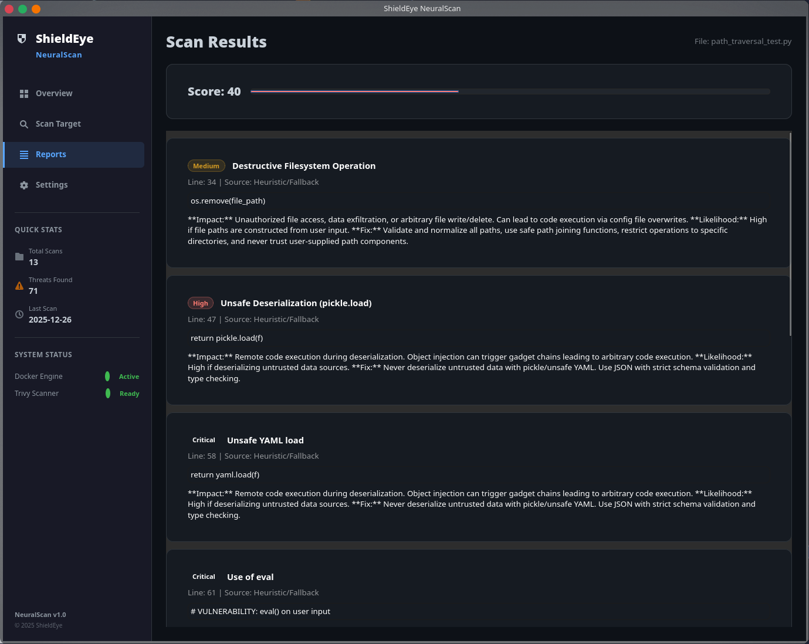
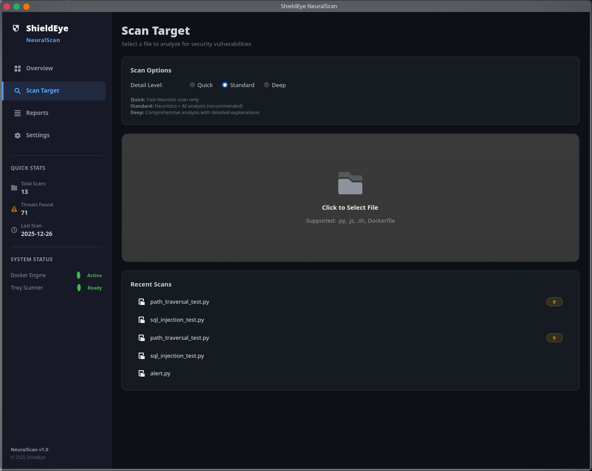
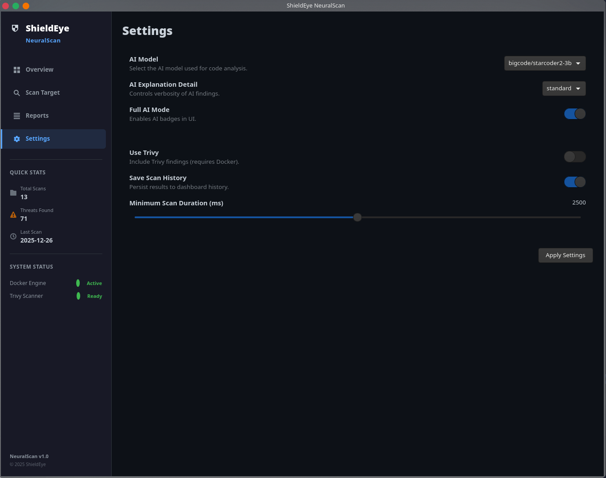

<div align="center">

# 🛡️ ShieldEye NeuralScan

**Local desktop source-code security scanner**

*Heuristic detection • Optional local AI explanations • Optional Trivy filesystem scan*

[](https://opensource.org/licenses/MIT)
[](https://www.python.org/)
[](https://www.gtk.org/)
[](https://huggingface.co/docs/transformers)
[](https://www.docker.com/)

[Features](#-key-features) • [Quick Start](#-quick-start) • [Screenshots](#-screenshots) • [Documentation](#-documentation) • [Contributing](#-contributing)

---



</div>

---

## 🎯 What is ShieldEye NeuralScan?

ShieldEye NeuralScan is a GTK4 desktop app that scans source files with regex-based security rules, optionally generates local AI explanations, and can add optional Trivy filesystem results through Docker.

What it currently does:

- Runs **29 detection rules** from `backend/rules.py`
- Supports local AI models: **StarCoder2-3B**, **StarCoder2-7B**, and **Mixtral-8x7B**
- Uses **heuristic fallback explanations** when AI is unavailable
- Optionally runs **Trivy filesystem scan** (`trivy fs`) through Docker
- Stores scan history and computes a **security score**
- Supports report export via `export_report()` in `backend/exporters.py` (**no GUI export trigger yet**)

---

## ✨ Key Features

- **29 heuristic rules** covering SQL injection, command injection, dynamic code execution (`eval`/`exec`), unsafe deserialization, weak cryptography, hardcoded secrets, path traversal/filesystem risks, and network/exfiltration indicators
- **Local AI inference** via Hugging Face Transformers with selectable models: `bigcode/starcoder2-3b`, `bigcode/starcoder2-7b`, `mistralai/Mixtral-8x7B-Instruct-v0.1`
- **Rule metadata mapping** in findings: CWE, OWASP Top 10 references, PCI-DSS, NIST, and GDPR fields (where defined by the matched rule)
- **Suppression support** for inline markers such as `# nosec` (suppressed findings are counted but omitted from final findings list)
- **Optional Trivy integration** for Docker-based filesystem scanning (`trivy fs --scanners vuln,secret`)
- **GTK4 dark UI** with dashboard, scan, results, and settings views

---

## 🖼️ Screenshots

<div align="center">

| Dashboard | Results |
|:---------:|:-------:|
|  |  |
| *Security posture overview and threat activity* | *Detailed findings with severity levels* |

| Scan Configuration | Settings |
|:------------------:|:--------:|
|  |  |
| *File selection and scan detail level options* | *AI model and scanner configuration* |

</div>

---

## 🏗️ Architecture

Current module layout:

```
┌──────────────────────────────────────────────────────────────┐
│                    GTK4 Desktop Interface                    │
│   ┌──────────┬──────────┬──────────┬──────────┐             │
│   │Dashboard │   Scan   │ Results  │ Settings │             │
│   └──────────┴──────────┴──────────┴──────────┘             │
└─────────────────────────────┬────────────────────────────────┘
                              │
                              ▼
┌──────────────────────────────────────────────────────────────┐
│                     backend/scanner.py                       │
│   Orchestrates scan flow, AI fallback, scoring, suppression │
└───────────────┬──────────────────┬───────────────────────────┘
                │                  │
                ▼                  ▼
      backend/rules.py      backend/ai_analyzer.py
      backend/scoring.py     backend/trivy.py
      backend/exporters.py
                │
                ▼
┌──────────────────────────────────────────────────────────────┐
│                       Local Storage                          │
│                 data/config.json, scan history              │
└──────────────────────────────────────────────────────────────┘
```

### Tech Stack

| Component | Technology | Purpose |
|-----------|------------|---------|
| GUI | GTK 4, PyGObject | Desktop interface |
| Scanner | Python regex rules | Heuristic vulnerability detection |
| AI | Hugging Face Transformers | Optional local finding explanations |
| Trivy | Docker + `aquasec/trivy` | Optional filesystem vulnerability/secret scan |
| Storage | JSON files in `data/` | Config and scan history |

---

## 🚀 Quick Start

### Prerequisites

| Requirement | Notes |
|-------------|-------|
| Python 3.10+ | Required |
| GTK4 + PyGObject | Required for GUI |
| Docker | Optional, only for Trivy scan |

### 1. Clone

```bash
git clone https://github.com/exiv703/ShieldEye-NeuralScan.git
cd ShieldEye-NeuralScan
```

### 2. Install dependencies

```bash
chmod +x run.sh
./run.sh --mode install
```

### 3. Launch app

```bash
./run.sh
```

Or launch directly:

```bash
./run.sh --mode gui
```

### 4. Optional: enable Trivy scan

Install/start Docker, then enable **Use Trivy** in the app Settings view.

### 5. Optional: run tests

```bash
./run.sh --mode test
```

---

## 🎮 Using `run.sh`

Interactive mode:

```bash
./run.sh
```

Supported modes:

- `./run.sh --mode gui`
- `./run.sh --mode install`
- `./run.sh --mode test`
- `./run.sh --mode exit`

Help:

```bash
./run.sh --help
```

---

## ⚙️ Configuration

Runtime settings are read from `data/config.json` (created from `config.default.json` on install if missing).

Keys currently used by the app runtime:

- `ai_enabled` (bool)
- `ai_model` (string)
- `ai_detail` (`short` | `standard` | `deep`)
- `use_trivy` (bool)
- `save_history` (bool)
- `scan_timeout` (int, milliseconds)

Example:

```json
{
  "ai_enabled": true,
  "ai_model": "bigcode/starcoder2-3b",
  "ai_detail": "standard",
  "use_trivy": false,
  "save_history": true,
  "scan_timeout": 2500
}
```

---

## 📖 Documentation

- Detection rules live in `backend/rules.py` — contributions welcome.
- Scanner orchestration: `backend/scanner.py`
- AI model loading/explanations: `backend/ai_analyzer.py`
- Optional Trivy integration: `backend/trivy.py`
- Report exporters: `backend/exporters.py`
- Scoring logic: `backend/scoring.py`
- Tests: `tests/` (8 pytest tests)

## 🛠️ Development

### Local setup

```bash
python3 -m venv .venv
source .venv/bin/activate
pip install -r requirements.txt
python -m gui.main
```

### Run tests

```bash
python -m pytest tests/ -v
```

### Project Structure

```
ShieldEye-NeuralScan/
├── backend/
│   ├── scanner.py          # Scan orchestration
│   ├── rules.py            # 29 heuristic rules
│   ├── scoring.py          # Security score and risk summaries
│   ├── ai_analyzer.py      # Local transformer model integration
│   ├── trivy.py            # Optional Docker-based trivy fs integration
│   └── exporters.py        # JSON/Markdown/HTML export
├── gui/
│   ├── main.py
│   ├── window.py
│   ├── style.css
│   └── views/
│       ├── dashboard.py
│       ├── scan.py
│       ├── results.py
│       └── settings.py
├── utils/
│   └── file_handler.py     # Scan history persistence
├── tests/
│   ├── test_scanner.py
│   ├── test_file_handler.py
│   └── samples/
├── assets/
├── data/
├── config.default.json
├── requirements.txt
└── run.sh
```

---

## 🤝 Contributing

Contributions are welcome! Here's how to get started:

1. **Fork** the repository
2. **Create** a feature branch: `git checkout -b feature/amazing-feature`
3. **Commit** your changes: `git commit -m 'Add amazing feature'`
4. **Push** to the branch: `git push origin feature/amazing-feature`
5. **Open** a Pull Request

**Guidelines:**
- Follow PEP 8 style guidelines
- Add tests for new security patterns
- Update documentation for new features
- Ensure all tests pass before submitting

---

## 📝 License

This project is licensed under the **MIT License** – see the [LICENSE](LICENSE) file for details.

---

## 🙏 Acknowledgments

- [Hugging Face](https://huggingface.co/) – Transformers library and model hosting
- [GTK Project](https://www.gtk.org/) – Cross-platform GUI toolkit
- [Aqua Security](https://www.aquasec.com/) – Trivy container scanner
- [BigCode](https://www.bigcode-project.org/) – StarCoder2 models
- [Mistral AI](https://mistral.ai/) – Mixtral models

---

<div align="center">

**⭐ If you find ShieldEye NeuralScan useful, please consider giving it a star! ⭐**

[](https://github.com/exiv703/ShieldEye-NeuralScan)

---

*Built with ❤️ for the security community*

**ShieldEye NeuralScan** – Securing code with AI, one scan at a time 🛡️

</div>
